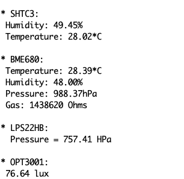

# RAK4631 Sensors Test

A project demonstrating how to use some of the sensors from the RAK4631 full set. Since [WisBlock](https://wisblock.io/) has four sensor slots and a comms slot, I have picked to start the BME680 environment sensor, the SHTC3 temp/humidity sensor, the LPS22HB pressure sensor and the OPT3001 light sensor. And I added the ESP32 comms module.

This sketch sets up the AP firmware, and initializes the sensors. Then in the loop, every 6 seconds or so, it displays data:

- bme680 temp;
- bme680 humidity;
- bme680 pressure;
- bme680 gas (volatile organic compounds, VOC);
- shtc3 temp;
- shtc3 humidity;
- lps22hb pressure;
- opt3001 light in lux;

Then every minute or so it updates the VariPass dashboard.

You need to set up an account at VariPass, and set up variables. The account Key and the variable IDs need to be set up in the sketch.

Once this is done you can look at your dashboard being populated. This is the result after a little experimenting:

